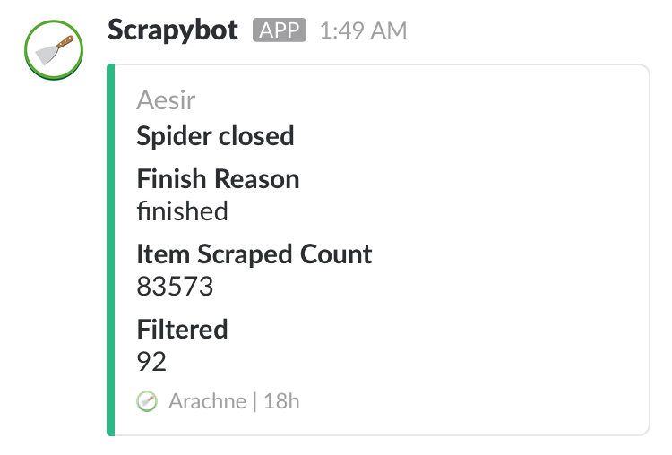

# scrapy-slackbot

[](https://pdm.fming.dev)
[](https://pypi.org/project/scrapy-slackbot/)
[](https://github.com/rudeigerc/scrapy-slackbot/blob/master/LICENSE)

A [Scrapy](https://scrapy.org/) extension for sending notification to Slack channels.

## Installation

```shell
$ pip install scrapy-slackbot
```

## Settings

In `settings.py`:

```python
EXTENSIONS = {
    'scrapyslackbot.extensions.SlackBot': 500,
}

SLACK_ENABLED = True
SLACK_BOT_TOKEN = ''
SLACK_CHANNEL = ''
```

### SLACK_ENABLED

A boolean which specifies whether the bot is enabled.

### SLACK_BOT_TOKEN

`Bot User OAuth Access Token` generated by **Slack**.

Follow the instructions of [Slack API](https://api.slack.com/slack-apps), visit `Features > OAuth & Permissions` and generate the token.

### SLACK_CHANNEL

The ID of the channel in your workspace.

## Development

We use [PDM](https://pdm.fming.dev/) as the package and dependency manager. Please make sure you have installed PDM at first.

```shell
$ pdm install
```

## Demo



## License

The project is licensed under the MIT License.
